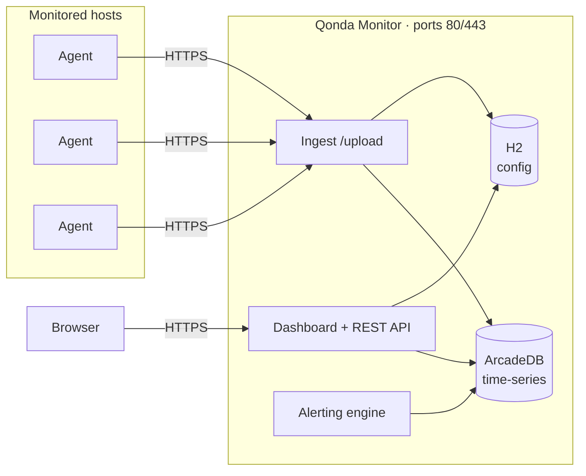

# Qonda Monitor

Infrastructure monitoring for **ArcGIS Enterprise** and **FME** environments — metrics, service health, request analytics, and alerting in a single self-contained server.

Qonda Monitor AIO is the all-in-one successor to the original split server/UI stack: one application that ingests agent uploads, stores everything in embedded databases, serves the web dashboard, and runs the alerting engine. There is nothing else to install — no external time-series database, no separate UI service, and a fresh install needs **zero configuration**.

## Documentation/Help

https://qondamonitor.com/help/aio

## Features

- **Host metrics** — CPU, memory, disk space and I/O, network throughput, process-level usage broken down by service (ArcGIS Server, Portal, DataStore, FME, IIS)
- **Service health** — health checks for ArcGIS Server, Portal, DataStore, Web Adaptor, and FME, including optional per-service ArcGIS health monitoring
- **Request analytics** — ArcGIS Server request logs, Portal activity, and FME job history with charts and paging
- **URL monitoring** — response time, status, uptime, and SSL certificate expiry for any URL
- **Alerting** — threshold rules per host/URL, org-level offline/unhealthy alerts, delivery via email and Pushover, with cooldowns and history
- **Reports** — host, service, URL, Portal activity, and FME summaries with percentile/IQR statistics
- **Self-upgrade** — in-place upgrade and restart from the dashboard (Config → System), checksum-verified
- **Zero-config first run** — all secrets auto-generated; the first sign-in creates the admin account and hands you a pre-filled agent config to download

## Architecture

- **One process, two embedded databases.** [ArcadeDB](https://arcadedb.com) holds all time-series data (samples, logs, health, alert history); H2 holds relational config (orgs, alert rules, tokens, host inventory). Neither opens a network port or has operator-visible credentials — the deployment's only network surface is the HTTPS endpoint.
- **Agents push, never listen.** Agents upload batches every 15 seconds over HTTPS with per-org bearer tokens, buffering locally when the server is unreachable. No inbound firewall rules on monitored hosts.
- **Retention built in.** Raw samples are kept for a configurable window (default 183 days) and pruned nightly; both databases are backed up automatically on a rotating schedule.

## Quick start

1. Run the server installer on a central host. The **Qonda Monitor Server AIO** service installs and starts automatically (a Java runtime is bundled).
2. Browse to `https://yourserver/` and sign in — **the first login creates the admin account** (built-in local authentication by default; ArcGIS OAuth and ArcGIS Server modes are available via `config.json`).
3. The first-login page shows your Org ID and agent token, and offers a **Download agent config.json** button pre-filled with the server address and certificate settings.
4. Install the agent on each host to monitor, drop the downloaded `config.json` into its folder, and start the agent service. Data appears on the dashboard within a minute.

Full details — configuration reference, authentication modes, SSL certificates, backups — are in the [documentation](docs/) (Docsify site; serve the `docs/` folder with any static web server, or read the markdown directly starting at [docs/index.md](docs/index.md)).

## Related components

- **Qonda Monitor Agent** — the per-host collector (separate project); talks to this server over the `/upload` multipart API

## License

Copyright © Ope Ltd. All rights reserved. See the license agreement shipped with the installer.
